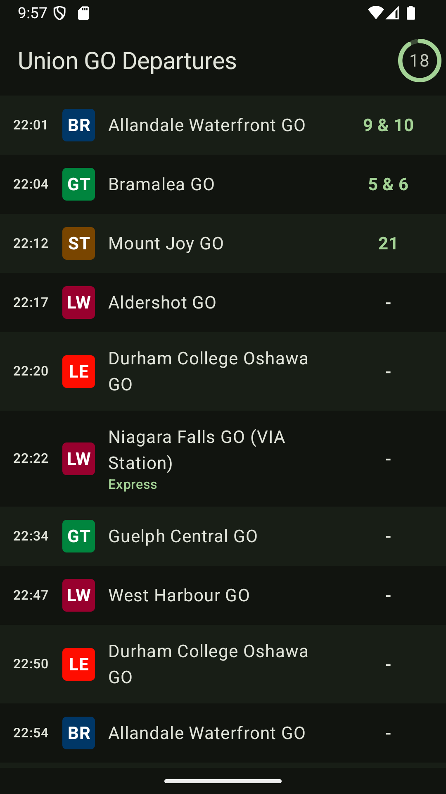
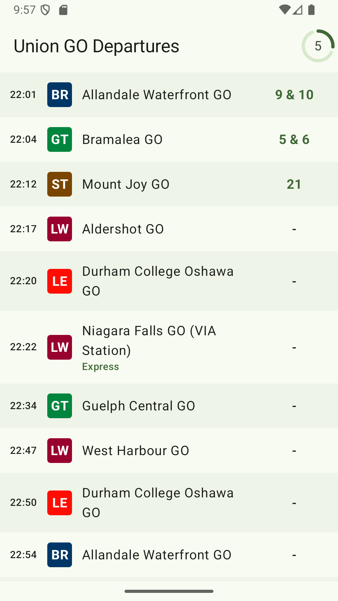
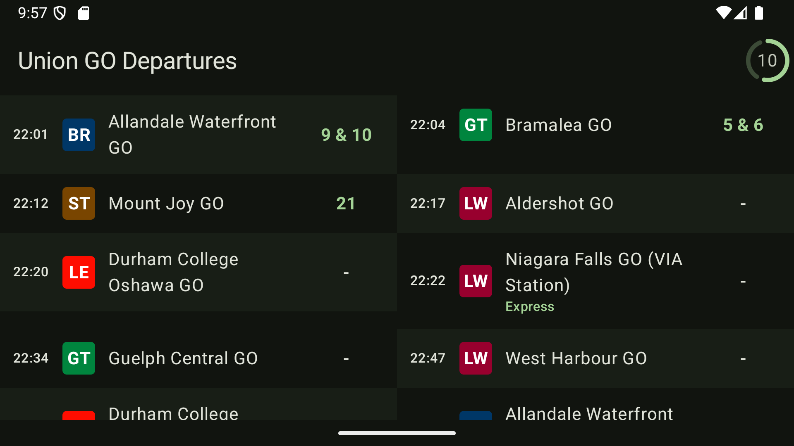

# GO Departure Screen

A multiplatform application that displays GO Transit bus and train schedules and information.

## Screenshots
<table>
<td>

</td>
</table>

## Privacy Policy

This app does not collect, store, nor share any personally identifiable information nor user data. 
